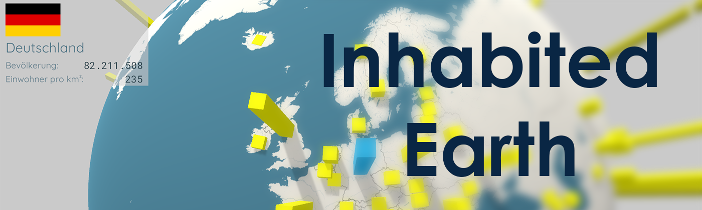

# Inhabited Earth

    

## Overview

An interactive 3D visualization tool demonstrating global population growth over time.

## Data Resources
- https://databank.worldbank.org/data/reports.aspx?source=Health%20Nutrition%20and%20Population%20Statistics:%20Population%20estimates%20and%20projections
- https://stats.oecd.org/Index.aspx?DataSetCode=REGION_DEMOGR#
- https://www.countryflags.com/en/image-overview

